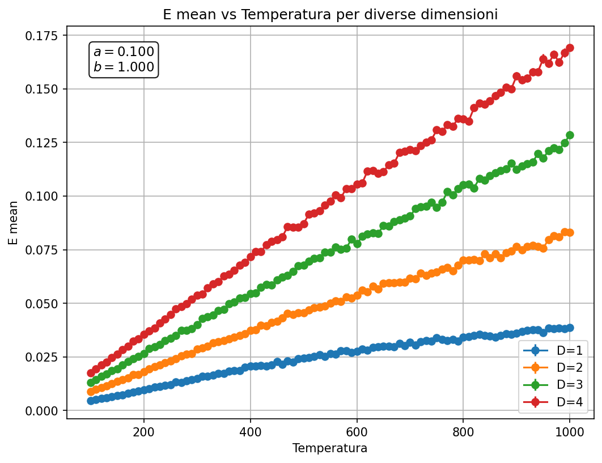
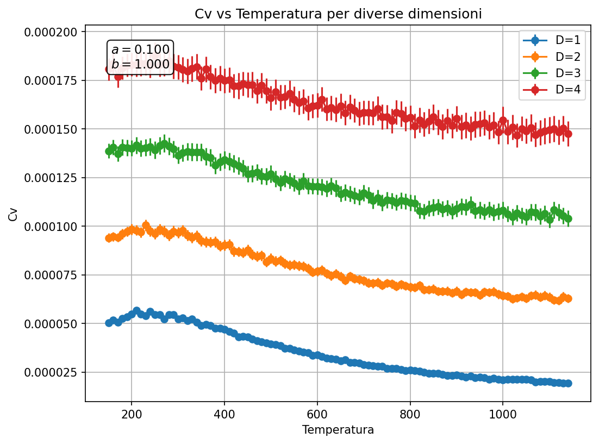
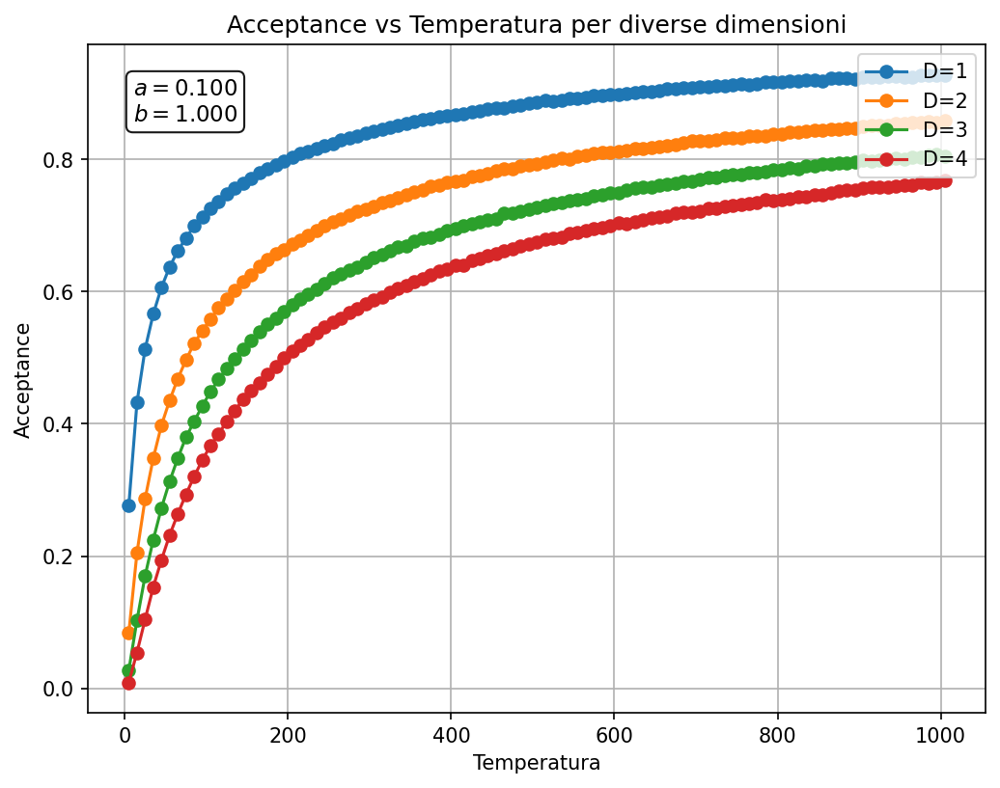
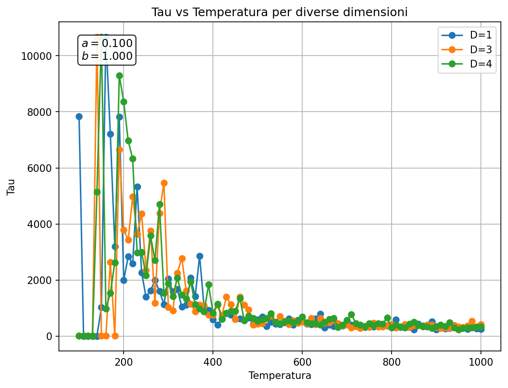

# Simulazione Monte Carlo di un sistema classico a doppia buca

Simulazione Metropolis-Hastings (MCMC) in JAX per lo studio termodinamico di un sistema classico descritto da un potenziale a doppia buca in D dimensioni, con analisi degli osservabili (energia, calore specifico, tempo di autocorrelazione) al variare di temperatura e dimensionalità.

## Indice

- [Descrizione del progetto](#descrizione-del-progetto)
- [Il modello fisico](#il-modello-fisico)
- [Metodologia](#metodologia)
- [Struttura del codice](#struttura-del-codice)
- [Come eseguire](#come-eseguire)
- [Risultati](#risultati)
- [Note e limiti](#note-e-limiti)
- [Autore](#autore)

## Descrizione del progetto

Il progetto implementa un campionatore Metropolis-Hastings per un sistema classico immerso in un potenziale a doppia buca lungo la prima coordinata e armonico lungo le eventuali coordinate aggiuntive. Per ogni dimensione D e temperatura T viene eseguita una simulazione MCMC completa (termalizzazione + produzione), da cui si estraggono gli osservabili termodinamici e le relative incertezze statistiche, stimate con tecniche di blocking analysis e con lo stimatore di Sokal per il tempo di autocorrelazione integrato.

Il codice è scritto interamente in **Python/JAX**, sfruttando `jax.lax.scan` e `jax.jit` per compilare l'intero ciclo di Metropolis e ottenere prestazioni elevate anche per catene molto lunghe (10⁵ passi per punto (D, T)).

## Il modello fisico

Il potenziale ha la forma:

```
V(x) = (a / b⁴) · (x₀² − b)² + ½ · Σᵢ₌₁ xᵢ²
```

- la prima componente `x₀` vede un **potenziale a doppia buca** con minimi in `x₀ = ±√b` e barriera regolata dal parametro `a`;
- le componenti aggiuntive `x₁, ..., x_{D-1}` (presenti per D > 1) sono soggette a un **potenziale armonico**, e servono a studiare come l'aggiunta di gradi di libertà "spettatori" influenzi il campionamento della coordinata rilevante.

Il campionamento è pesato secondo la distribuzione di Boltzmann `p(x) ∝ exp(−V(x) / (kB·T))`, con `kB` espresso in eV/K.

## Metodologia

**Algoritmo di campionamento**
- Proposta gaussiana: `x' = x + step_size · η`, con `η ~ N(0, I)`.
- Criterio di accettazione di Metropolis: `P_acc = min(1, exp(−ΔV / (kB·T)))`.
- Ogni catena viene termalizzata prima della fase di produzione; la configurazione finale di ogni temperatura è usata come punto di partenza per la successiva (warm-start), riducendo il transiente ad ogni step di temperatura.

**Stima delle incertezze**
- **Blocking analysis**: la varianza della media è stimata raddoppiando progressivamente la dimensione dei blocchi fino al raggiungimento di un plateau nel rapporto `R(m) = m · Var(blocco) / Var(totale)`, rilevato con una finestra scorrevole in scala logaritmica.
- **Tempo di autocorrelazione integrato (metodo di Sokal)**: calcolato tramite FFT della funzione di autocorrelazione, con finestra automatica `τ_int` troncata al passo `t > c · τ`.
- **Propagazione degli errori** per il calore specifico `Cv = (⟨E²⟩ − ⟨E⟩²) / (kB·T²)`, ottenuta a partire dagli errori di blocking su `⟨E⟩` e `⟨E²⟩`.

**Osservabili calcolati**
- Energia media `⟨E⟩` e relativo errore
- Calore specifico `Cv` e relativo errore
- Tasso di accettazione della catena
- Tempo di autocorrelazione `τ` sulla coordinata `x₀`

## Struttura del codice

```
.
├── main.py         # orchestrazione della simulazione: cicli su D e T, raccolta risultati
├── metropolis.py   # generatori di configurazioni iniziali, step di Metropolis, jax.lax.scan
├── observable.py    # potenziale, blocking analysis, stima di Sokal, calcolo osservabili
├── plot.py         # generazione dei grafici in report/
└── report/         # output grafico (creato automaticamente all'esecuzione)
```

## Come eseguire

```bash
pip install jax jaxlib matplotlib tqdm numpy
python main.py
```

I parametri principali della simulazione (dimensioni, range di temperatura, numero di passi, parametri del potenziale a e b) sono impostati all'inizio di `main()` in `main.py`.

## Risultati

I grafici seguenti sono stati generati con una versione ridotta della simulazione (griglia di temperature più rada e catene più brevi rispetto alla configurazione di default in `main.py`), a scopo puramente illustrativo della pipeline; l'esecuzione completa con i parametri di default produce risultati più stabili e con incertezze inferiori.

**Termalizzazione.** Confronto tra due inizializzazioni diverse (configurazione fissa vs. casuale): entrambe le catene convergono rapidamente alla stessa regione di equilibrio, a conferma dell'ergodicità della catena nel regime di temperatura considerato.


**Energia media vs temperatura.** Come atteso da equipartizione, l'energia media cresce con la temperatura e con la dimensionalità D (più gradi di libertà armonici contribuiscono linearmente all'energia).



**Calore specifico vs temperatura.** Il calore specifico mostra la transizione dal regime di singola buca (basse T, moto confinato in uno dei due minimi) al regime in cui il sistema esplora entrambe le buche (alte T), con un comportamento non monotono legato all'attivazione del grado di libertà del doppio pozzo.



**Tasso di accettazione vs temperatura.** Il tasso di accettazione della proposta Metropolis varia con T, riflettendo la diversa rugosità del paesaggio energetico percepito a diverse temperature.



**Tempo di autocorrelazione vs temperatura.** Il tempo di autocorrelazione stimato con il metodo di Sokal cresce sensibilmente a basse temperature, segnale del rallentamento critico (critical slowing down) dovuto all'intrappolamento della catena in uno dei due minimi del potenziale a doppia buca.



## Note e limiti

- A basse temperature il campionamento Metropolis standard soffre di **mode trapping**: la catena fatica ad attraversare la barriera di potenziale tra le due buche, portando a stime di `τ` fortemente sottostimate o instabili se non diagnosticate correttamente (si veda il warning "plateau not found" emesso da `find_plateau` quando il plateau nel blocking non viene rilevato entro la finestra data).
- Le incertezze riportate sono valide nella misura in cui la catena ha effettivamente raggiunto l'equilibrio ergodico nel numero di passi simulato; a T molto basse questa condizione va verificata con cura (finestra di blocking più ampia, controllo incrociato con lo stimatore di Sokal).
- Questo codice costituisce la baseline MCMC standard di un progetto di tesi più ampio, che confronta questo approccio con metodi basati su **Boltzmann Generators** (normalizing flow) e **Flow-MCMC**, allo scopo di valutare vantaggi e limiti di ciascun metodo di campionamento nel regime di bassa temperatura dove il sistema Metropolis classico è affetto da critical slowing down.

## Autore

**Riccardo Pivi**